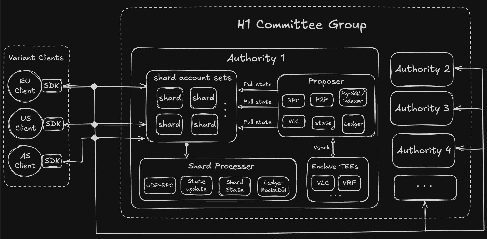

# FastLog

## Overview

The Fastlog is used for recording in distributed and immutable append logs scenario.    

It's use the **byzantine consistent broadcast(BCB)** and **TEE-VLC** as core modules or features.

## FastLog Arch



## Compile

### Build from source

```bash
git clone https://github.com/ai-chen2050/fastlog.git

cd fastlog

cargo build --release --features nitro-enclaves
```

## Run fastlog

[TODO]

```bash
cargo build --release
cd target/release
rm -f *.json *.txt

# Create configuration files for 4 authorities with 4 shards each.
# * Private server states are stored in `server*.json`.
# * `committee.json` is the public description of the FastPay committee.
for I in 1 2 3 4
do
    ./server --server server"$I".json generate --host 127.0.0.1 --port 9"$I"00 --shards 4 >> committee.json
done

# Create configuration files for 1000 user accounts.
# * Private account states are stored in one local wallet `accounts.json`.
# * `initial_accounts.txt` is used to mint the corresponding initial balances at startup on the server side.
./client --committee committee.json --accounts accounts.json create_accounts 1000 --initial-funding 100 >> initial_accounts.txt

# Start servers
for I in 1 2 3 4
do
    for J in $(seq 0 3)
    do
        ./server --server server"$I".json run --shard "$J" --initial-accounts initial_accounts.txt --committee committee.json &
    done
 done

# Query (locally cached) balance for first and last user account
ACCOUNT1="`head -n 1 initial_accounts.txt | awk -F: '{ print $1 }'`"
ACCOUNT2="`tail -n -1 initial_accounts.txt | awk -F: '{ print $1 }'`"
./client --committee committee.json --accounts accounts.json query_balance "$ACCOUNT1"
./client --committee committee.json --accounts accounts.json query_balance "$ACCOUNT2"

# Transfer 10 units
./client --committee committee.json --accounts accounts.json transfer 10 --from "$ACCOUNT1" --to "$ACCOUNT2"

# Query balances again
./client --committee committee.json --accounts accounts.json query_balance "$ACCOUNT1"
./client --committee committee.json --accounts accounts.json query_balance "$ACCOUNT2"

# Launch local benchmark using all user accounts
./client --committee committee.json --accounts accounts.json benchmark

# Inspect state of first account
grep "$ACCOUNT1" accounts.json

# Kill servers
kill %1 %2 %3 %4 %5 %6 %7 %8 %9 %10 %11 %12 %13 %14 %15 %16

# Additional local benchmark
./bench

cd ../..
```

## References

* [BCB: Byzantine Consistent Broadcast](https://www.bc.edu/content/dam/bc1/schools/mcas/cs/pdf/honors-thesis/Thesis_Yifan-Zhang.pdf)
* [FastPay: High-Performance Byzantine Fault Tolerant Settlement](https://arxiv.org/abs/2003.11506)